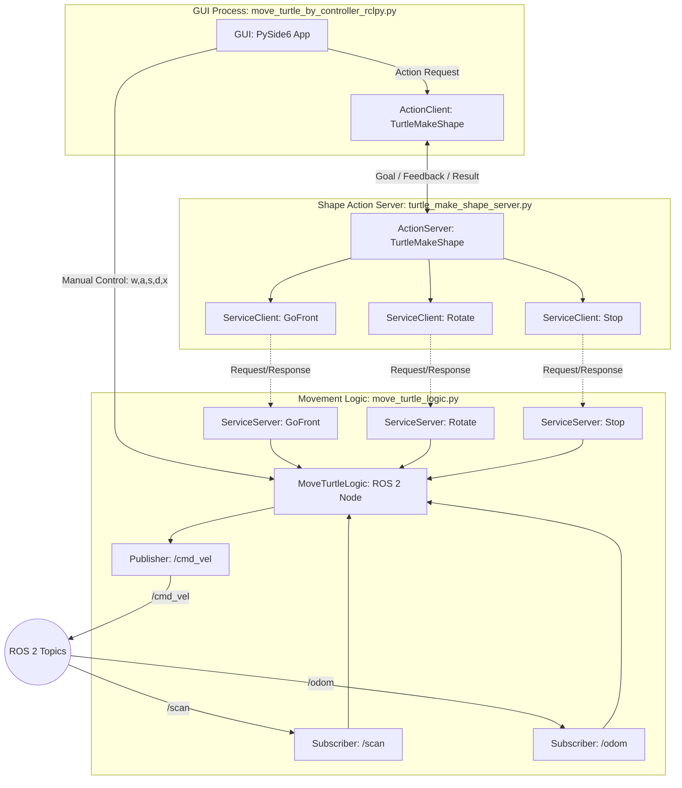

'''md
# 기능 명세서 -  ROS 2 TurtleBot 제어 시스템

## 1 개요

본 문서는 ROS 2(Robot Operating System 2)를 기반으로 TurtleBot3 로봇을 제어하는 시스템의 기능 명세서를 제공합니다. 이 시스템은 사용자에게 GUI를 통한 수동 제어 기능과 함께, 액션(Action) 인터페이스를 통해 사각형 및 삼각형과 같은 복잡한 도형을 그리도록 명령할 수 있는 기능을 제공합니다. 로봇의 기본적인 움직임 제어, 센서 데이터 처리, 그리고 고수준의 작업 수행이 모듈화되어 ROS 2 통신 메커니즘(토픽, 서비스, 액션)을 통해 상호작용합니다.

## 2 주요 구성 요소

시스템은 크게 두 개의 ROS 2 패키지와 여러 노드로 구성됩니다.

- **`my_package_msgs`**: ROS 2 사용자 정의 메시지(Action, Service) 정의를 포함하는 패키지.
- **`my_turtlebot_pkg`**: 로봇 제어 로직, GUI 애플리케이션, 액션 서버 등을 포함하는 패키지.

**`my_turtlebot_pkg` 내 주요 노드 및 클래스:**

- **`move_turtle_logic.py` (노드명: `move_turtle_logic`)**:
    - 로봇의 기본적인 움직임(직진, 회전, 정지)을 담당하는 핵심 로직.
    - 라이다 및 오도메트리 센서 데이터를 처리하여 장애물 감지 및 로봇 위치 추적.
    - 다른 노드들이 로봇의 기본 움직임을 요청할 수 있도록 ROS 2 서비스 서버를 제공.
- **`move_turtle_by_controller_rclpy.py` (노드명: `move_turtle_logic` 내부에 통합)**:
    - PySide6 기반의 GUI 애플리케이션.
    - 사용자에게 키보드/마우스 클릭을 통한 수동 로봇 제어 인터페이스 제공.
    - 도형 그리기 액션 목표를 `turtle_make_shape_server` 노드로 전송하는 액션 클라이언트 역할.
- **`turtle_make_shape_server.py` (노드명: `turtle_make_shape_server`)**:
    - `TurtleMakeShape` 액션 인터페이스를 구현하는 액션 서버.
    - 도형 그리기 목표를 받아 `move_turtle_logic` 노드의 서비스들을 호출하여 실제 로봇 움직임을 지시.
    - 액션 진행 상황에 대한 피드백 및 최종 결과 제공.
- **`turtle_pose_and_position.py` (클래스)**:
    - `move_turtle_logic` 노드 내에서 사용되는 헬퍼 클래스.
    - 오도메트리(Odometry) 메시지를 구독하여 로봇의 현재 2D 자세(x, y, yaw)를 추적.
- **`controller_ui.py`**:
    - PySide6 GUI의 사용자 인터페이스 정의 (Qt Designer로 생성).

## 3 각 구성 요소의 기능

### 3.1 `my_package_msgs` (메시지 정의)

- **`action/TurtleMakeShape.action`**:
    - **Goal**:
        - `int32 shape_type`: 그릴 도형의 종류 (1: 사각형, 2: 삼각형).
        - `float32 side_length`: 도형의 한 변 길이 (미터).
        - `int32 iterations`: 도형을 그릴 반복 횟수.
    - **Result**:
        - `bool success`: 액션 성공 여부.
        - `string message`: 액션 완료 메시지.
    - **Feedback**:
        - `string status`: 현재 액션 진행 상태 메시지 (예: "Drawing square 1/1, side length 0.5m").
- **`srv/GoFront.srv`**:
    - **Request**:
        - `float32 length`: 앞으로 이동할 거리 (미터).
    - **Response**:
        - `bool success`: 서비스 호출 성공 여부.
- **`srv/Rotate.srv`**:
    - **Request**:
        - `float32 angle_degrees`: 회전할 각도 (도).
    - **Response**:
        - `bool success`: 서비스 호출 성공 여부.
- **`srv/Stop.srv`**:
    - **Request**: (없음)
    - **Response**:
        - `bool success`: 서비스 호출 성공 여부.

### 3.2 `move_turtle_logic.py` (노드: `move_turtle_logic`)

- **센서 처리**:
    - `/scan` 토픽으로부터 `sensor_msgs/LaserScan` 메시지를 구독하여 라이다 데이터 처리.
    - 전방(좌우 45도 범위)의 최소 장애물 거리(`front_min`)를 계산.
    - `is_obstacle_ahead()` 함수를 통해 0.3m 이내 장애물 감지 여부 반환.
    - `/odom` 토픽으로부터 `nav_msgs/Odometry` 메시지를 구독하여 로봇의 현재 자세(x, y, yaw) 추적 (`TurtlebotPose` 클래스 활용).
- **로봇 제어**:
    - `/cmd_vel` 토픽으로 `geometry_msgs/Twist` 메시지를 발행하여 로봇의 선속도 및 각속도 제어.
    - `set_linear_velocity(speed)`: 로봇의 선속도를 설정하고 속도 제한(`MAX_LINEAR_VEL`) 적용.
    - `set_angular_velocity(speed)`: 로봇의 각속도를 설정하고 속도 제한(`MAX_ANGULAR_VEL`) 적용.
    - `_internal_stop()`: 로봇의 선속도와 각속도를 0으로 설정하고 즉시 `/cmd_vel` 발행하여 로봇 정지.
    - `stop()`: GUI 또는 키보드 입력에 의한 정지 명령 처리. `_internal_stop()` 호출 및 로그 기록.
    - `go_front(length)`: 지정된 거리만큼 로봇을 직진시키는 블로킹(blocking) 함수. `set_linear_velocity()`를 사용하고 목표 거리에 도달하면 `_internal_stop()` 호출.
    - `rotate(angle_degrees)`: 지정된 각도만큼 로봇을 회전시키는 블로킹 함수. `set_angular_velocity()`를 사용하고 목표 각도에 도달하면 `_internal_stop()` 호출.
- **서비스 서버**:
    - `go_front_service` (`my_package_msgs/GoFront`): `go_front()` 함수를 호출하여 로봇을 직진시킴.
    - `rotate_service` (`my_package_msgs/Rotate`): `rotate()` 함수를 호출하여 로봇을 회전시킴.
    - `stop_service` (`my_package_msgs/Stop`): `_internal_stop()` 함수를 호출하여 로봇을 정지시킴.
- **장애물 회피**:
    - `update_and_publish()` 함수 내에서 `is_obstacle_ahead()`를 주기적으로 확인하여, 전방에 장애물이 감지되고 로봇이 전진 중일 경우 자동으로 로봇을 정지시킴.
- **로깅**:
    - `add_log(msg)`: 시스템에서 발생하는 로그 메시지를 내부 큐(`log_queue`)에 저장.

### 3.3 `move_turtle_by_controller_rclpy.py` (GUI 애플리케이션)

- **GUI 인터페이스**:
    - PySide6를 사용하여 로봇 제어 버튼(전진, 후진, 좌회전, 우회전, 정지), 도형 그리기 버튼(삼각형, 사각형), 모니터링 화면(로그, 거리, 자세) 제공.
- **수동 제어**:
    - GUI 버튼 클릭 또는 키보드 입력('w', 'x', 'a', 'd', 's')에 따라 `move_turtle_logic` 노드의 `update_key()` 함수를 직접 호출하여 로봇의 선속도 및 각속도 조절.
- **액션 클라이언트**:
    - `TurtleMakeShape` 액션 서버(`turtle_make_shape_server`)에 대한 클라이언트 역할.
    - "Triangle" 또는 "Square" 버튼 클릭 시, `_send_shape_goal()` 함수를 통해 `TurtleMakeShape` 액션 목표를 전송.
    - 액션 서버로부터 피드백(`_feedback_callback`) 및 결과(`_get_result_callback`)를 수신하여 GUI 모니터링 화면에 표시.
- **ROS 2 통합**:
    - `MoveTurtleLogic` 노드를 인스턴스화하여 GUI와 동일한 프로세스에서 실행.
    - `MultiThreadedExecutor`를 사용하여 GUI 이벤트 루프와 ROS 2 콜백(오도메트리, 라이다, 액션 클라이언트 콜백)이 병렬로 처리되도록 함.
    - `QTimer`를 사용하여 `ros_main_loop()`를 주기적으로 호출, GUI 업데이트 및 `move_turtle_logic`의 `update_and_publish()` 호출.

### 3.4 `turtle_make_shape_server.py` (노드: `turtle_make_shape_server`)

- **액션 서버**:
    - `turtle_make_shape` 액션 인터페이스를 구현.
    - `goal_callback()`: 수신된 액션 목표를 승인.
    - `handle_accepted_callback()`: 승인된 목표를 실행하기 위해 `execute_callback()` 호출.
    - `execute_callback(goal_handle)`:
        - 요청된 `shape_type`, `side_length`, `iterations`에 따라 사각형 또는 삼각형을 그림.
        - 도형을 그리는 동안 `goal_handle.publish_feedback()`을 통해 진행 상태를 액션 클라이언트에 전송.
        - `_draw_square_segment()` 또는 `_draw_triangle_segment()` 함수를 호출하여 실제 움직임 지시.
        - 액션이 완료되면 `goal_handle.succeed()` 또는 `goal_handle.abort()`를 호출하고 결과 메시지 반환.
        - 액션 도중 취소 요청이 들어오면 `goal_handle.canceled()` 처리.
- **서비스 클라이언트**:
    - `move_turtle_logic` 노드가 제공하는 `go_front_service`, `rotate_service`, `stop_service`에 대한 클라이언트 역할.
    - `_call_go_front_service(length)`: `go_front_service`를 호출하여 로봇을 직진시킴.
    - `_call_rotate_service(angle_degrees)`: `rotate_service`를 호출하여 로봇을 회전시킴.
    - `_call_stop_service()`: `stop_service`를 호출하여 로봇을 정지시킴.
    - 모든 서비스 호출은 비동기적으로 이루어지며 (`await future`), 서비스 응답을 기다림.

## 4 데이터 흐름 및 상호작용

1. **초기화**:
    - `move_turtle_by_controller_rclpy.py` 실행 시, `move_turtle_logic` 노드가 생성되고 `MultiThreadedExecutor`에 추가되어 GUI와 함께 스핀됩니다.
    - `turtle_make_shape_server.py` 실행 시, `turtle_make_shape_server` 노드가 생성되고 `MultiThreadedExecutor`에 추가되어 액션 서버 및 서비스 클라이언트를 초기화합니다.
    - `move_turtle_logic` 노드는 `/scan` 및 `/odom` 토픽을 구독하고, `go_front_service`, `rotate_service`, `stop_service`를 서비스 서버로 제공합니다.
    - `turtle_make_shape_server` 노드는 `move_turtle_logic`의 서비스 클라이언트들을 초기화하고 서비스가 사용 가능해질 때까지 대기합니다.
2. **수동 제어 (GUI/키보드)**:
    - 사용자가 GUI 버튼을 클릭하거나 키보드를 입력하면, `move_turtle_by_controller_rclpy`의 `MainWindow` 클래스 내 이벤트 핸들러가 `logic_engine` (즉, `move_turtle_logic` 노드 인스턴스)의 `update_key()` 함수를 직접 호출합니다.
    - `update_key()`는 `logic_engine`의 내부 `velocity` 및 `angular` 변수를 업데이트하고, `update_and_publish()` 함수가 이 값을 `/cmd_vel` 토픽에 발행합니다.
3. **도형 그리기 (액션)**:
    - 사용자가 GUI의 "Triangle" 또는 "Square" 버튼을 클릭하면, `move_turtle_by_controller_rclpy`는 `turtle_make_shape_server` 노드로 `TurtleMakeShape` 액션 목표를 전송합니다.
    - `turtle_make_shape_server`는 목표를 수락하고 `execute_callback`을 비동기적으로 실행합니다.
    - `execute_callback`은 도형을 그리기 위해 `_call_go_front_service()` 및 `_call_rotate_service()` 함수를 반복적으로 호출합니다.
    - 이 `_call_..._service()` 함수들은 `move_turtle_logic` 노드의 해당 서비스 서버(`go_front_service`, `rotate_service`)에 요청을 보내고 응답을 기다립니다.
    - `move_turtle_logic` 노드는 서비스 요청을 받으면 `go_front()` 또는 `rotate()` 함수를 실행하여 로봇을 움직이고, 이 과정에서 `/cmd_vel` 토픽에 속도 명령을 발행합니다.
    - `turtle_make_shape_server`는 도형 그리기 진행 상황을 `TurtleMakeShape.Feedback` 메시지로 액션 클라이언트(`move_turtle_by_controller_rclpy`)에 전송하고, 최종적으로 `TurtleMakeShape.Result` 메시지를 전송합니다.
    - `move_turtle_by_controller_rclpy`는 수신된 피드백과 결과를 GUI 모니터링 화면에 표시합니다.
4. **센서 기반 자율 동작**:
    - `move_turtle_logic` 노드는 `/scan` 토픽을 통해 라이다 데이터를 지속적으로 모니터링합니다.
    - `update_and_publish()` 함수는 로봇이 전진 중이고 전방에 장애물이 감지되면 자동으로 `_internal_stop()`을 호출하여 로봇을 정지시킵니다.

## 5 시스템 아키텍처 다이어그램

# git 레포

https://github.com/jalanwang/ros2.git

<aside>

서브폴더(메인 노드와 액션/서비스 인터페이스)

</aside>

https://github.com/jalanwang/ros2/tree/main/src/my_turtlebot_pkg/my_turtlebot_pkg

https://github.com/jalanwang/ros2/tree/main/src/my_package_msgs

# 작업일지

[홈웍1/2] https://www.notion.so/1-2-Gazebo-TrutleBot3-304689a59a3d803e94bed47ca656f68e?source=copy_link

[홈웍2/2/] https://www.notion.so/2-2-Gazebo-TurtleBot3-30b689a59a3d80c58d91e142935d8f43?source=copy_link
